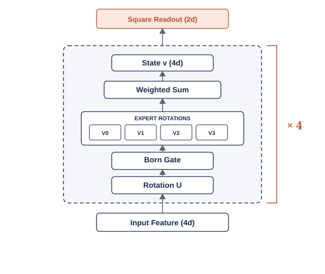

# `asi_L4` architecture

`asi_L4` is QYield's shipped research model for WM-811K wafer novelty detection. It combines a frozen ResNet50 encoder, a depth-4 Adaptive State Injection head, and Euclidean prototype classification.

## 1. End-to-end architecture


**Figure 1. QYield feature-processing architecture.** The pale-blue wafer grid represents the input wafer field, and orange cells mark defective dies. Navy cards identify processing stages, navy dots represent feature values, and orange dots represent four-value feature blocks. Solid pale-blue arrows trace feature flow. The orange dashed frame groups the per-block ASI transform, and orange cards identify highlighted stages and the two-value readout.

| Stage | Shape per batch | Status |
|---|---:|---|
| Grayscale wafer input | `(B, 224, 224)` | Input |
| ResNet50 feature vector | `(B, 2048)` | Frozen encoder output |
| Four-mode feature blocks | `(B, 512, 4)` | ASI input |
| `asi_L4` output | `(B, 1024)` | Trainable ASI output |
| Class prototypes | one 1,024-vector per support class | Computed from support data |

ResNet50 produces a 2,048-dimensional embedding. `asi_L4` reshapes it into 512 independent four-value blocks, applies the same depth-4 ASI structure to each block, and reads two values from every final block. The head therefore produces `512 x 2 = 1,024` output values.

## 2. Repeated ASI block



**Figure 2. Repeated `asi_L4` unit block.** Navy cards identify the input state, learned transformations, and intermediate state. Grey arrows show sequential state flow. The navy dashed frame encloses one ASI layer. The orange bracket and `x 4` identify four sequential layers, and the orange card identifies the final two-value square readout.

Each block begins with four real values normalised into state `v`. Every ASI layer produces another normalised four-value state. The fourth layer feeds the square readout.

### Layer equations

For layer `l` and state `v`:

```text
U_l = exp(A_l - A_l^T)
a = U_l v

g_0 = a[0]^2
g_1 = a[1]^2
g_2 = a[2]^2
g_3 = max(0, 1 - g_0 - g_1 - g_2)

V_l^(o) = exp(B_l^(o) - B_l^(o)^T)
y_o = V_l^(o) a

v_next = sum_o g_o y_o
v_next = v_next / ||v_next||
```

`U_l` and `V_l^(o)` are real `4 x 4` orthogonal transforms. `U_l` creates the routing state. The four `V_l^(o)` transforms provide four learned expert paths. The squared amplitudes form four routing weights whose sum is one.

| Quantity | Value | Meaning |
|---|---:|---|
| Input state | 4 values | Normalised feature block |
| Rotation `U_l` | one `4 x 4` transform | Learned mode mixing |
| Routing weights | 4 | Three explicit weights and one remainder weight |
| Expert transforms | four `4 x 4` transforms | One transform per routing outcome |
| Layer output | 4 values | Weighted expert mixture followed by L2 normalisation |
| ASI depth | 4 layers | Four sequential ASI layers per block |
| Readout | 2 values | Squares of the first two final-state values |

One block has five learned transforms per layer: one `U_l` rotation and four `V_l^(o)` expert rotations. Four layers give 20 transforms per block. Across 512 blocks, `asi_L4` contains 10,240 learned four-mode transforms.

### Routing structure

The routing configuration is:

```text
n_pool = min(configured_n_pool, m - 1)
n_exp = n_pool + 1
```

For `asi_L4`, `m = 4`, `n_pool = 3`, and `n_exp = 4`. The first three weights come from explicit squared amplitudes. The fourth weight represents the remaining probability mass.

The structure follows a mixture-of-experts pattern: the input creates routing weights, every expert transforms the state, and the weights determine each expert's contribution. The routing weights operate inside the feature head. ProtoNet performs class decisions after the head.

## 3. Modes, depth, and readout

| Concept | QYield value | Meaning |
|---|---:|---|
| Modes per block | 4 | Width of one ASI state |
| ASI depth | 4 | Sequential layers applied to that state |
| Feature blocks | 512 | Independent ASI states processed per embedding |
| Experts per layer | 4 | Conditional transforms per ASI layer |
| Output values per block | 2 | Square readout from the final state |

Modes define state width. Depth defines the number of transformations applied to that state.

### Born routing and softmax

| Property | Born routing in `asi_L4` | Classical softmax |
|---|---|---|
| Input | Normalised amplitudes `a_i` | Logits `z_i` |
| Formula | `g_i = a_i^2` | `p_i = exp(z_i) / sum_j exp(z_j)` |
| Normalisation | State norm | Exponential normalisation |
| Role | Routes ASI experts | Routes model outputs or experts |
| QYield use | Internal feature routing | Absent from `asi_L4` |

Born routing uses squared amplitudes after learned orthogonal mixing. The resulting values form a four-outcome categorical distribution.

## 4. ML configuration

| Parameter | Value |
|---|---:|
| Image size | `224 x 224` |
| Backbone | Frozen ImageNet ResNet50 |
| Preprocessing | `jet` colour map and ImageNet normalisation |
| Input embedding | 2,048 |
| Feature blocks | 512 |
| Values per block | 4 |
| ASI depth | 4 |
| Experts and routing outcomes per layer | 4 |
| Readout values per block | 2 |
| Output embedding | 1,024 |
| Distance metric | Euclidean |
| Classifier | Nearest class prototype |
| Novelty score | Negative nearest-prototype distance |
| Trainable head parameters | 163,840 |

## 5. Trainable parameter tensors

The implementation stores full `4 x 4` matrices, antisymmetrises them, and applies a matrix exponential.

| Parameter | Tensor shape | Stored parameters |
|---|---:|---:|
| Layer rotations, `conv_skew` | `(512, 4, 4, 4)` | 32,768 |
| Expert rotations, `exp_skew` | `(512, 4, 4, 4, 4)` | 131,072 |
| **Total** |  | **163,840** |

A skew-symmetric `4 x 4` generator has six independent values. The 10,240 transforms therefore have at most 61,440 effective generator degrees of freedom. The checkpoint stores the full parameter tensors.

## 6. Product runtime and photonic interpretation

Physical ASI uses optical modes, detector outcomes, classical feedforward, and conditional photon injection. QYield translates the mode-mixing and Born-routing concepts into deterministic tensor operations.

| Physical concept | QYield implementation |
|---|---|
| One photon across four modes | Normalised real four-value state |
| Interferometer | Learned orthogonal `4 x 4` transform |
| Born outcome probabilities | Squared amplitudes used as routing weights |
| Outcome-conditioned transform | Weighted mixture of four expert transforms |
| Detector shots | Exact branch expectation in PyTorch |

Product runtime uses PyTorch on CPU or GPU with zero photonic sources, detectors, hardware shots, injected photons, or allocated QPUs. Each block executes independently, and the head uses real-valued matrix algebra. [`qyield-physics.md`](qyield-physics.md) describes the physical ASI mechanism and the product adaptation.

## 7. Training and evaluation configuration

| Parameter | Value |
|---|---|
| Trainable component | `asi_L4` head |
| Frozen component | ImageNet ResNet50 |
| Training classes | Center, Edge-Ring, Edge-Loc |
| Base training split | Stratified 70% of each training class |
| Optimiser | Adam |
| Learning rate | `1e-3` |
| Updates | 1,000 |
| Meta-batch size | 16 episodes |
| Training episodes per seed | 16,000 |
| Support per training episode | 15 selections, 3 classes x 5 shots |
| Training queries per episode | 45 selections, 3 classes x 15 queries |
| Support selections per seed | 240,000 |
| Training-query selections per seed | 720,000 |
| Objective | Cross-entropy over negative query-to-prototype distances |

The episodic sampler draws support and query examples from `base_train`. Each training episode uses all three base classes. The 16,000 episodes per seed produce 960,000 sampled image selections. These totals describe episodic sampling activity. The underlying `base_train` pool supplies the source wafer images throughout training.

The matched evaluation protocol and control results are documented in [`qyield-technical.md`](qyield-technical.md) and [`results-novelty.md`](results-novelty.md).

## 8. Classification and novelty


**Figure 3. Prototype-distance scoring in a projected embedding space.** Orange, navy, and green identify labelled-class clusters. Filled circles are support embeddings, same-colour `x` symbols are class prototypes, and the black circle is a query embedding. The navy dashed segment connects the query to its nearest prototype.

```text
prototype_c = mean(embedding(x) for x in support examples of class c)
d_c = EuclideanDistance(query_embedding, prototype_c)
predicted_class = argmin_c d_c
novelty_score = -min_c d_c
```

Higher novelty scores indicate a closer match to a known prototype. Lower scores indicate greater separation from the support-set classes.

## 9. Research lineage and source mapping

QYield adapts the photonic ASI mechanism described by Monbroussou et al. and measurement-conditioned routing ideas described by Hwang et al. The shipped model uses the `asi_L4` single-photon feature-state interpretation and exact branch expectation in PyTorch.

- Physical ASI source: L. Monbroussou et al., ["Photonic Quantum Convolutional Neural Networks with Adaptive State Injection"](../papers/base/2504.20989v1.pdf), arXiv:2504.20989v1, 2025.
- Measurement-conditioned routing source: K. Hwang et al., ["Distributed quantum machine learning via classical communication"](../papers/base/2408.16327v1.pdf), arXiv:2408.16327v1, 2024.
- Product implementation: [`../../src/qyield/model_l4.py`](../../src/qyield/model_l4.py), `ASIDeepHead`.
- Research implementation: [`../src/dpqcnn/fswmpr/bench/qreg_bench.py`](../src/dpqcnn/fswmpr/bench/qreg_bench.py), `RegHead(kind="asi_deep")`.
- Checkpoint export: [`../src/dpqcnn/fswmpr/bench/export_asi_l4.py`](../src/dpqcnn/fswmpr/bench/export_asi_l4.py).

The model operates in a classically tractable single-photon regime. Its demonstrated contribution is a quantum-inspired feature map for wafer novelty detection.
