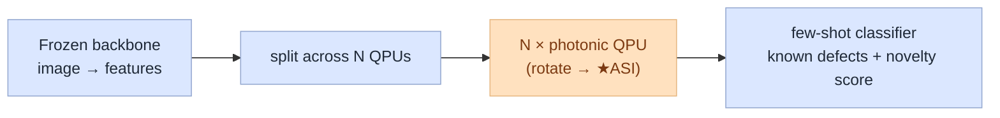
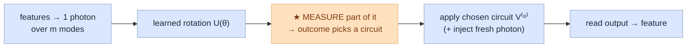
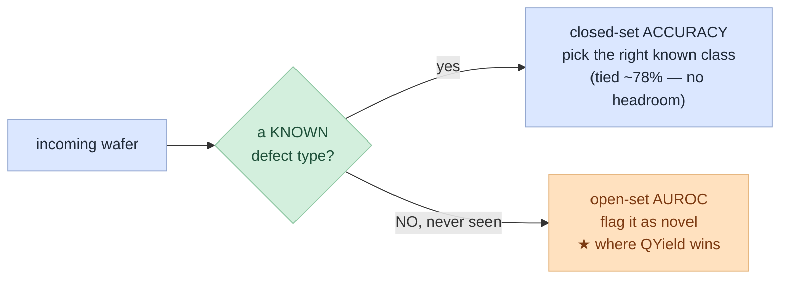

# QYield — Summary

**QYield** — an adaptive photonic-quantum feature head for wafer-defect inspection.
(Technical id: `asi_L4`, the depth-4 Adaptive State Injection model — the one model we carry forward.)

---

## TL;DR

- **Problem:** fabs get blindsided by *new* defect types their AI was never trained on.
- **Solution:** QYield reshapes a standard image model's features so a never-seen defect stands out as
  "not like anything known."
- **Result (11 seeds, same backbone):** QYield reaches **71.5 novelty AUROC** — **+10.4 over the CNN
  baseline** and **+5.3 over SN-ProtoNet**, the strongest principled classical control — CIs separated.
- **Why it holds up:** the win is the head's *structure* (norm-preserving **+** adaptive), not the
  backbone, the parameter count, or "being quantum" — each isolated by a control below.

---

## 1. Problem & solution

**Problem.** Fabs lose yield to *rare, novel* wafer-defect patterns. A classifier trained on known
defect types silently misclassifies a genuinely new failure mode as "known," often after wafers are
already scrapped.

**Solution.** QYield adds a small trainable photonic-quantum layer on top of a standard frozen image
backbone. It reshapes the features so a defect *unlike anything seen in training* is pushed away from
the known clusters and flagged as novel — improving this open-set detection by ~10 points over the
no-head baseline and ~5 over the best classical alternative, with no change to deployment.

---

## 2. What QYield is

Frozen backbone → features → split across N tiny photonic circuits (QPUs). Each QPU does a learned
rotation, then the new step — **ASI**: it *measures* part of the state and lets that outcome *choose*
which learned circuit processes the rest.

**Inside one QPU** (ASI — the only non-classical part):

**The one idea:** *measure-then-choose is a data-dependent branch.* A plain rotation applies the same
transform to every input (a classical linear layer). Letting the measurement outcome select the circuit
means different inputs take different paths — capacity a fixed layer cannot express. QYield stacks 4
such blocks (depth 4); all transforms are norm-preserving (orthogonal + renormalization), so the head
adds routing **without** distorting the feature geometry (see §5).

---

## 3. How we evaluate — few-shot episodes

A fab can label only a handful of examples of a rare defect, so we test that way.

- **N-way K-shot:** each episode gives the model **N** classes with **K** labelled examples each, then
  asks it to sort fresh queries into those N. **`3w5s`** = 3 classes × 5 examples; **`5w5s`** = 5 × 5
  (harder). More classes = harder.
- **Base vs novel:** the model trains on **base** (common) classes and is evaluated on **novel** classes
  it *never saw* — the realistic "new failure mode" case.
- Reported over 100 episodes × 11 seeds with 95% CIs.

---

## 4. Metric — novelty AUROC (not accuracy)

- **Novelty AUROC** = how well a "how novel is this?" score separates never-seen defects from known
  ones. **1.0 = perfect, 0.5 = coin-flip.** This is the fab-relevant number.
- **Why not accuracy:** closed-set accuracy is **saturated** — every head sits at ~76–78% because the
  known classes are easy to separate, so accuracy can't distinguish models. All signal is in novelty.
  Accuracy is reported only to confirm it never regresses.

---

## 5. Results — three-way comparison (11 seeds, same backbone)

Every head is **frozen ResNet50 → [head] → prototype classifier**; only the head changes, so any gap
is the head alone. The three headline lines (full 15-head landscape in `qyield-technical.md` §8):

| model | role | novelty AUROC ↑ |
|---|---|---|
| **ProtoNet-ResNet50** | CNN baseline (no head — the floor) | 61.1 ± 1.0 |
| **SN-ProtoNet** (+ spectral head) | strong classical control | 66.2 ± 0.8 |
| **QYield** (+ adaptive photonic head) | quantum | **71.5 ± 0.9** |

- **QYield: +5.3 over SN-ProtoNet, +10.4 over the CNN baseline** — CIs separated; accuracy tied ~78%
  across all three (no regression).
- **The win is the head's structure — not "being quantum" or capacity** — isolated by controls
  (`qyield-technical.md` §8): a *non-adaptive* photonic head only ties the classical control (~66), while
  free and even QYield-param-matched MLPs fall *below* the floor (56–59).

**Mechanism (grounded, not circular):** a freely-trained head reshapes to fit the *seen* classes and
collapses the directions that distinguish *unseen* ones ("feature collapse"). Bounding the head's
operator norm makes it distance-preserving (bi-Lipschitz), which cannot collapse distances — the
established OOD principle behind SN-ProtoNet (spectral normalization / SNGP, Liu et al. 2020; Miyato et
al. 2018). QYield keeps that guarantee **and** adds measurement-conditioned routing, so it exceeds the
norm-preserving classical ceiling.

---

## 6. Scope & next

- **Honest scope:** a fair, same-backbone **novelty** win — not an accuracy-SOTA claim. At this scale
  QYield is classically simulable, so the advantage is **quantum-*inspired*** (a better feature map),
  not yet a proven quantum *hardware* moat.
- **Next:** (1) push depth + multi-photon toward the classically-hard-but-trainable regime where a
  hardware moat could exist; (2) test on correlation-structured inspection data (this wafer data is
  classically separable, which caps the achievable edge).
