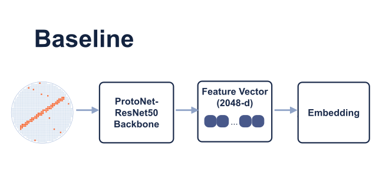
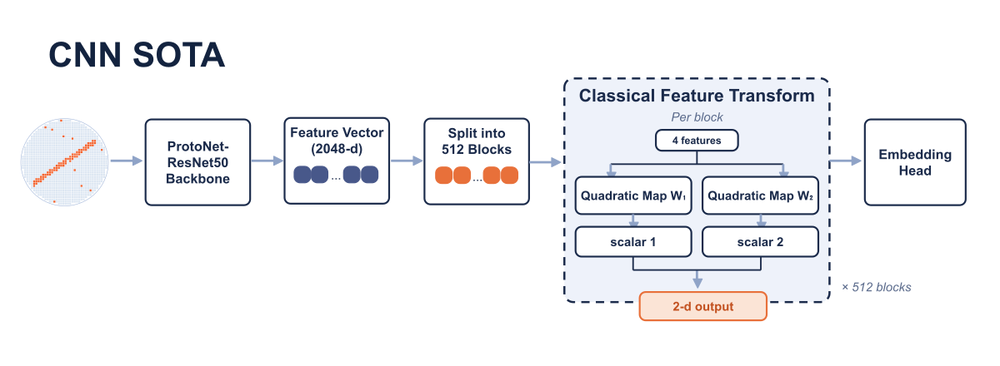
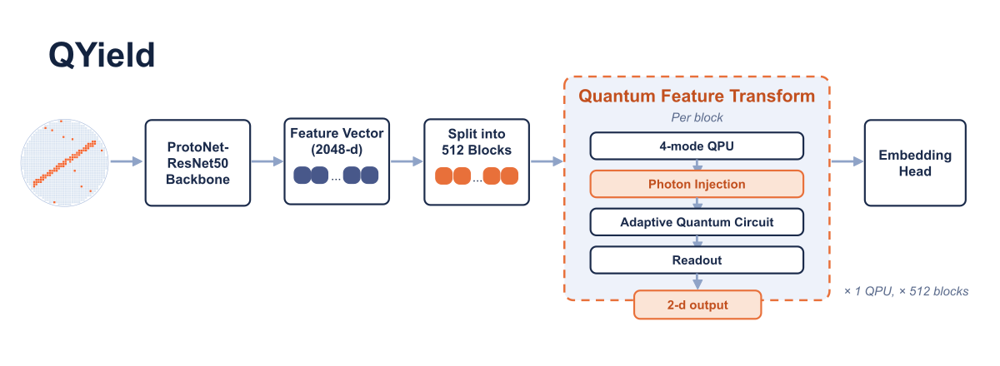

# QYield summary

QYield is a research prototype for few-shot wafer-defect novelty detection on WM-811K. It uses a frozen ResNet50 encoder, the trainable `asi_L4` Adaptive State Injection head, and prototype classification to rank known defect classes and identify unfamiliar patterns.

The product returns a class ranking and `novelty_score`. The score is the negative distance to the nearest support-set prototype. Higher scores indicate a closer match to a known class, while lower scores mean the query is likely a new defect type.

## Architecture comparison

**Figure 1a. No-head ProtoNet-ResNet50 baseline.**

**Figure 1b. SN-ProtoNet (CNN SOTA) architecture.**

**Figure 1c. QYield architecture.**

**Figure 1. Matched architecture comparison.** Panels 1a through 1c use the same frozen ResNet50 encoder and prototype classifier. The pale-blue wafer grid represents the input field, orange cells mark defective dies, navy cards show processing stages, and solid pale-blue arrows show feature flow. Orange dots and cards identify four-value blocks and highlighted block-level stages. The QYield panel uses the depth-4 ASI head, the CNN SOTA panel uses a spectral-normalised classical map, and the baseline has no trainable feature head.

The `asi_L4` head processes the 2,048-dimensional ResNet50 embedding in 512 independent four-value blocks and produces a 1,024-dimensional output embedding. It uses a single-photon, exact-expectation PyTorch formulation. The detailed design, configuration, and physics scope are in [`asi-l4-architecture.md`](asi-l4-architecture.md) and [`qyield-technical.md`](qyield-technical.md).

## Matched result

The `asi_L4` head trains on 16,000 base-class episodes per seed, using 240,000 support selections and 720,000 training-query selections. The experiment evaluates 1,100 3-way, 5-shot WM-811K episodes across 11 seeds. Each evaluation episode uses 15 support selections and 80 scored queries, giving 16,500 support selections and 88,000 query observations. All compared paths use the same backbone, episode sampler, classifier, and novelty scorer. Only the feature head changes.

| Model | Novelty AUROC |
|---|---:|
| ProtoNet-ResNet50, no feature head | 61.12 +/- 0.97 |
| SN-ProtoNet, strongest tested classical control | 66.19 +/- 0.84 |
| QYield, `asi_L4` | **71.47 +/- 0.95** |

Closed-set accuracy remains near 76 to 78 percent across the main controls. This result supports novelty detection on the tested benchmark, not an accuracy SOTA claim. Full methods and results are in [`results-novelty.md`](results-novelty.md).

## Scope

- `asi_L4` is the one carried-forward R&D model and the shipped checkpoint represents one trained seed.
- The reported result is the 11-seed mean for the tested WM-811K split and episode protocol.
- The head is classically simulable. Hardware, speed, energy, and multi-photon advantages are outside the demonstrated scope.

## Research basis

QYield adapts the photonic ASI mechanism from Monbroussou et al., ["Photonic Quantum Convolutional Neural Networks with Adaptive State Injection"](../papers/base/2504.20989v1.pdf), and measurement-conditioned routing concepts related to Hwang et al., ["Distributed quantum machine learning via classical communication"](../papers/base/2408.16327v1.pdf). The product computes the resulting feature head in PyTorch without physical photon injection, detector sampling, or QPU communication.
