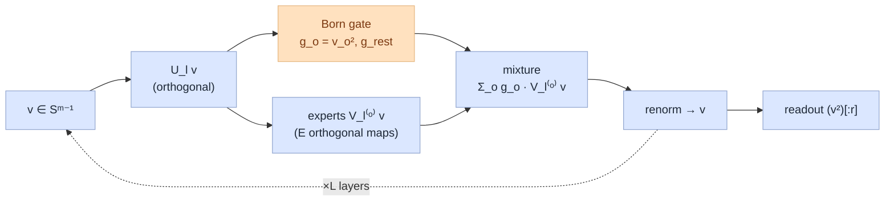

# QYield — Technical Summary

Technical companion to `qyield-summary.md` (which carries the business framing, the results table, and the
"why novelty not accuracy" argument). **This file is self-contained but does not repeat those**: it
specifies the architecture, the math, why the structure works, the photonic realization, and the exact
protocol. Everything is defined; the reader is assumed technical but not familiar with this project.

---

## 0. System in one paragraph

Each wafer map is passed through a **frozen ResNet50** (ImageNet weights, `jet` colormap
preprocessing) to a 2048-d global-average-pooled embedding `e`. A small **trainable head** `f_θ`
reshapes `e`; a **prototype few-shot classifier** (class = nearest mean under Euclidean distance) reads
out. We score **open-set novelty AUROC** — the area under the ROC of a per-query "novelty" score that
must separate *known-class* queries from *held-out-novel-class* queries. QYield is the head `f_θ`. The
result (11 seeds): 71.5 AUROC, +5.3 over the strongest classical control (SN-ProtoNet), +10.4 over the
no-head floor — full table in `qyield-summary.md` §5. Only the head changes between conditions; the backbone
and classifier are fixed, so any difference is attributable to `f_θ`.

---

## 1. Encoding (backbone → per-QPU states)

`e ∈ ℝ^{2048}` is reshaped into `N = 2048/m = 512` blocks of `m = 4` and each block is L2-normalized:

```
v_i = b_i / ‖b_i‖ ∈ S^{m-1},   i = 1..N        (unit vector on the (m−1)-sphere)
```

Photonic reading: `v_i` is the amplitude vector of a **single photon over `m` modes**
(`|v_i⟩ = Σ_x v_{i,x} |mode x⟩`). Each of the `N` blocks is one QPU. Note the per-block normalization
discards `‖b_i‖`; the head operates purely on directions on the sphere.

---

## 2. QYield head (`asi_L4`) — exact per-layer math

Per QPU, state `v ∈ ℝ^m` (`m=4`), depth `L=4`, pooling modes `P=3`, experts `E = P+1 = 4`.
Each layer `l` applies **conv → Born gate → expert mixture → renormalize**:

```
(conv)     v ← U_l v,                 U_l = exp(A_l − A_lᵀ) ∈ SO(m)          # learned rotation
(gate)     g_o = v_o²  for o=1..P,    g_rest = 1 − Σ_{o≤P} v_o²             # Born probs, Σ_o g_o = 1
(experts)  V_l^{(o)} = exp(B_l^{(o)} − B_l^{(o)ᵀ}) ∈ SO(m),  o = 1..E
(mixture)  v ← Σ_{o=1}^{E} g_o · (V_l^{(o)} v)                              # branch-expectation
(renorm)   v ← v / ‖v‖
```

Readout after `L` layers: `feature = (v ⊙ v)[:r]`, `r = 2` modes → 2 features/QPU → **1024-d embedding**
to the prototype classifier.

**Parameters** (all in the skew generators `A_l, B_l^{(o)}`):
`N·L·m² (conv) + N·L·E·m² (experts) = 512·4·16 + 512·4·4·16 = 32,768 + 131,072 = 163,840`.

`A_l, B_l^{(o)}` are free real `m×m` matrices; `exp(·−·ᵀ)` maps them to the special orthogonal group,
so the rotations are unconstrained within `SO(m)` yet exactly orthogonal by construction.



---

## 3. Why this structure works — capacity without collapse

Two properties, jointly, are the whole point:

**(a) Norm-bounded ⇒ no feature collapse.** `U_l` and each `V_l^{(o)}` are orthogonal (isometries). The
mixture is a **convex** combination (`g` is a probability vector), so
`‖Σ_o g_o V^{(o)} v‖ ≤ Σ_o g_o ‖V^{(o)} v‖ = ‖v‖`; renormalization returns it to the sphere. The map
can never blow up or crush distances to zero — it is bi-Lipschitz-like on `S^{m-1}`. A free head
(`Linear→act→Linear`, or a bilinear `zᵀWz`) has **unbounded singular values**, so training on the seen
classes can collapse the directions that distinguish unseen classes ("feature collapse") — empirically
these land *below* the no-head floor regardless of size or a residual skip (SUMMARY §5).

**(b) Data-dependent gating ⇒ capacity beyond a fixed rotation.** If the experts were tied
(`V^{(o)} ≡ V`), then `Σ_o g_o V v = V v`: a single orthogonal map — a pure isometry, which adds nothing
a distance classifier can use. Because the experts **differ** and the weights `g_o(v)` depend on the
input via the Born rule, `v ↦ Σ_o g_o(v) V^{(o)} v` is **nonlinear and non-isometric** — a
data-dependent convex mixture of distinct isometries. This is what lets QYield exceed the
norm-preserving classical ceiling (~66) rather than merely matching it.

So QYield occupies the sweet spot: **isometry-breaking (adds capacity) but norm-bounded (cannot
collapse)** — unlike a fixed orthogonal map (bounded but no adaptive capacity → caps at ~66) and unlike
a free MLP (adaptive capacity but unbounded → collapses below the floor).

---

## 4. Photonic realization & simulability

At `n=1` photon the state *is* the amplitude vector `v ∈ ℝ^m`, so every operation maps to linear
optics: `U_l` = a particle-number-preserving beam-splitter mesh (`U(m)`); `v²` = Born photon-detection
probabilities; `g_o` = the probability of a click in pooling mode `o`; expert selection `V^{(o)}` =
**classical feedforward** — the detector click conditions the next unitary (real adaptive injection). On
hardware, the readout expectations require `S` shots/QPU; in simulation the branch-expectation (§2, §5)
is computed exactly.

**Simulability:** because `n=1`, the head is a sequence of `m×m` real matrix ops — **classically exact
and cheap** (this is why training/serving run on a GPU). A genuine quantum-hardness argument requires
the **multi-photon** regime (`n≥2`), where the induced map involves matrix **permanents** (#P-hard);
that regime is *not* exercised by QYield here. Hence the honest label is **quantum-inspired**, not a
proven hardware advantage.

---

## 5. Training & differentiability

The Born gate `g_o = v_o²` and the mixture are smooth functions of `v` — the head computes the **exact
expectation over measurement outcomes** (a finite Born-weighted sum), *not* a Monte-Carlo sample — so
`f_θ` is fully differentiable end-to-end. Training: Adam (`lr=1e-3`), meta-batched episodic **prototype
loss** `CE(−cdist(query, class_prototypes))` on the base classes, 1000 updates, `meta_batch=16`. Only
the head trains; the backbone is frozen. (On real hardware the same expectations would be estimated from
`S` shots per QPU — a source of variance not present in simulation.)

---

## 6. Experimental protocol

- **Data:** WM-811K wafer maps, FSWMPR few-shot split. **Base** classes {Center, Edge-Ring, Edge-Loc}
  (trained on); **novel** classes {Donut, Loc, Near-full, Random, Scratch} (never trained on).
- **Episode:** 3-way 5-shot (`3w5s`) — 3 classes × 5 support examples; queries scored by distance to the
  3 class prototypes. (`NwKs` generalizes: N classes, K shots.)
- **Closed-set accuracy:** fraction of known-class queries assigned the correct known class.
- **Open-set novelty AUROC:** per episode, novelty score `s = −min_c ‖query − prototype_c‖` (`mindist`);
  AUROC measures separation of known-class vs held-out-novel-class queries. Headline scorer = `mindist`
  (the L2 the prototype loss optimizes).
- **Statistics:** 100 episodes × **11 seeds** (42/123/456/7/99/2024/11/22/33/44/55), 95% CIs.
- **Fairness:** identical frozen ResNet50-jet features for *every* head; only `f_θ` differs.

---

## 7. Control heads (definitions)

All operate on the same per-QPU `z` (reshaped, L2-normalized); `read` = first `r=2` output modes.

| head | map `f_θ(z)` per QPU | class |
|---|---|---|
| **ProtoNet-ResNet50** (floor) | identity (`e` → prototype directly) | — |
| classical | `zᵀ W z`, `W = ½(C+Cᵀ)` symmetric, trainable | free quadratic |
| **SN-ProtoNet** | `zᵀ W z` with `W ← W/‖W‖₂` each step (spectral norm → operator-norm ≤ 1) | norm-preserving |
| orthogonal | `(Q z)²[:r]`, `Q = exp(A−Aᵀ) ∈ SO(m)` | norm-preserving |
| quantum | fixed photonic bank + Born `|ψ|²` readout (no gating) | norm-preserving, non-adaptive |
| mlp | `W₂·act(W₁ z + b₁) + b₂` (relu/gelu; free variants: residual, param-matched to QYield) | free nonlinear |
| dense | `(W z)²`, one large free `W` | free |
| **QYield** (`asi_L4`) | §2 (Born-gated orthogonal-expert mixture, depth 4) | norm-preserving **+ adaptive** |

`SN-ProtoNet` is the spectral-normalized head — the **bi-Lipschitz / distance-preserving** classical
control, the established principle for OOD/novelty detection (spectral normalization: Miyato et al.
2018; distance-aware OOD via SNGP: Liu et al. 2020). It, not a naive MLP, is the strong classical
competitor QYield is measured against.

---

## 8. Full experimental results (every head tested, 11 seeds)

All on frozen ResNet50-jet, 3w5s, `mindist`, 11 seeds; `qyield-summary.md` §5 shows the pitch-selected
subset. Ordered by novelty AUROC.

| head | class | params | closed-set acc | novelty AUROC ↑ |
|---|---|---|---|---|
| mlp_gelu_164k | free nonlinear (param-matched) | 162,304 | 75.85 ± 0.76 | 56.49 ± 1.06 |
| dense1024 | free linear | 2,098,176 | 65.95 ± 0.49 | 56.06 ± 1.13 |
| mlp_res_gelu | free nonlinear (residual, matched) | 163,328 | 75.90 ± 0.74 | 55.88 ± 1.10 |
| mlp_res_relu | free nonlinear (residual, matched) | 163,328 | 76.35 ± 0.71 | 56.64 ± 1.07 |
| mlp_relu_164k | free nonlinear (param-matched) | 162,304 | 76.31 ± 0.82 | 57.38 ± 1.06 |
| mlp_gelu | free nonlinear | 40,448 | 75.80 ± 0.90 | 57.74 ± 1.01 |
| mlp_relu | free nonlinear | 40,448 | 76.07 ± 0.94 | 59.03 ± 0.97 |
| **ProtoNet-ResNet50** (identity) | baseline / floor | 0 | 76.15 ± 0.67 | 61.12 ± 0.97 |
| classical | free quadratic (bilinear) | 16,384 | 76.39 ± 0.87 | 65.37 ± 0.97 |
| orthogonal | norm-preserving | 8,192 | 77.78 ± 0.65 | 66.00 ± 0.88 |
| **SN-ProtoNet** (spectral) | norm-preserving | 16,384 | 77.40 ± 0.74 | 66.19 ± 0.84 |
| quantum | norm-preserving, non-adaptive | 5,345 | 78.39 ± 0.76 | 66.26 ± 1.01 |
| asi_p2 | norm-preserving + adaptive (depth 1, P=2) | 32,768 | 77.92 ± 0.68 | 68.77 ± 0.85 |
| asi_p3 | norm-preserving + adaptive (depth 1, P=3) | 40,960 | 77.92 ± 0.69 | 69.21 ± 0.75 |
| **QYield** (`asi_L4`) | norm-preserving + adaptive (depth 4, P=3) | 163,840 | 78.47 ± 0.75 | **71.47 ± 0.95** |

Reads three tiers: **free heads 56–59 < floor 61.1 < norm-preserving 65–66 < adaptive 69–71.5**. The
`asi_p2 → asi_p3 → asi_L4` progression (68.8 → 69.2 → 71.5) is the depth/pooling-width trend.
(Other conditions on record in `results-novelty.md`: in-domain SSL features, `cosine`/`knn1` scorer
diagnostics, Conv4-backbone baselines — all secondary/cross-backbone, not the headline.)

---

## 9. Base papers — what QYield adopts

QYield fuses the core gadgets of two works (both in `../papers/base/`). "ASI" in `asi_L4` is
directly **A**daptive **S**tate **I**njection from paper 1.

**Paper 1 — Monbroussou et al., "Photonic QCNN with Adaptive State Injection," arXiv:2504.20989
(2025).** First experimental *photonic* QCNN on particle-number-preserving linear optics (QD source,
8/12-mode interferometers, SNSPD; binary image classification).
- *Innovation:* **adaptive state injection** as the nonlinear gadget for linear optics — a pooling
  layer that photon-counts some modes and, conditioned on the outcome, **injects a fresh photon +
  applies a conditioned unitary** (a measurement-based CPTP map, hence nonlinear). Particle-number/
  subspace preservation gives barren-plateau resistance (trainability), with amplitude ("tensor")
  encoding and a beam-splitter-mesh convolution.
- *Adopted by QYield:* (i) amplitude encoding → per-QPU unit vector `v` (§1); (ii) particle-number-
  preserving convolution → the orthogonal `U_l` (§2); (iii) **adaptive state injection** → the
  measure-then-conditioned-unitary step, realized as the Born-gated expert mixture
  `Σ_o g_o V^{(o)} v` (§2); (iv) subspace preservation → the norm-preservation that prevents feature
  collapse (§3).

**Paper 2 — Hwang et al., "Distributed quantum machine learning via classical communication,"
arXiv:2408.16327 (2024).** Links multiple small QPUs by **classical communication** (mid-circuit
measurement + feedforward) instead of quantum communication; QCNN backbone, synthetic-data
classification.
- *Innovation:* a measurement outcome on one QPU **selects which unitary (`U_0`/`U_1`) another QPU
  applies** (Fig. 1). This raises circuit capacity (effective dimension: NC ⊂ CC ⊂ QC) to near
  quantum-communication levels at shallow depth while staying NISQ-feasible; a **trainable interpret
  function** `f = Σ_k w_k P[pattern_k]` is shown essential (parity readout loses up to ~10 pts).
- *Adopted by QYield:* (i) **measurement-conditioned feedforward** (outcome selects the applied
  unitary) → the same "outcome picks the circuit" logic inside each QPU's expert selection; (ii) the
  distributed **many-small-QPU** decomposition → the `N=512` independent per-QPU heads; (iii) the
  trainable-interpret idea informs the learned readout (the minimal `asi_L4` uses a squared-amplitude
  readout; the full DP-APQCNN proposal in `qyield-technical.md` adds the interpret tensor + cross-QPU CC).

**Honest distillation note.** The implemented `asi_L4` is a **differentiable, single-photon,
classically-simulable realization** of these two mechanisms — the Born-gated orthogonal-expert mixture
is the exact-expectation analog of "measure a mode, and let the click select a conditioned unitary." It
does *not* physically inject photons into ancilla modes or run feedforward between separate chips;
those are the hardware forms the base papers demonstrate and the multi-photon scale-up direction (§4).

---

## 10. What is and isn't established


- **Established:** on identical frozen ResNet50 features, an isometry-breaking-but-norm-bounded head
  (QYield) beats the norm-preserving classical ceiling (~66) by +5.3 and the no-head floor by +10.4 on
  open-set novelty AUROC, 11-seed CI-separated; the win is isolated to the *adaptive gating* by the
  non-adaptive photonic control (`quantum`, 66.3) and to *structure* by the free/param-matched controls
  (≤59, below floor).
- **Not established:** any hardware/energy advantage (`n=1` ⇒ classically simulable ⇒ quantum-inspired);
  any accuracy-SOTA claim (closed-set accuracy is saturated ~78 across heads); any result on
  correlation-structured or non-separable data (this wafer data is classically separable, which upper-
  bounds the achievable edge). The hardware-moat regime is multi-photon (permanent-based), untested here.
