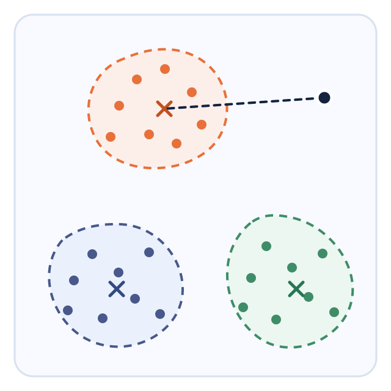

# QYield novelty results

## Claim under test

Does the `asi_L4` head improve detection of held-out wafer-defect classes when the backbone, classifier, episode sampler, and novelty score are fixed?

## Protocol

- Dataset: WM-811K FSWMPR few-shot split.
- Training classes: Center, Edge-Ring, Edge-Loc.
- Held-out novelty classes: Donut, Loc, Near-full, Random, Scratch.
- Episode: 3-way, 5-shot.
- Backbone: frozen ImageNet ResNet50 with `jet` preprocessing.
- Classifier: Euclidean nearest prototype.
- Novelty score: negative distance to the nearest known-class prototype (`mindist`).
- Evaluation: 100 episodes across 11 seeds: 42, 123, 456, 7, 99, 2024, 11, 22, 33, 44, 55.
- Intervals: 95% confidence intervals.

The table below is the final 11-seed result. It replaces earlier 3-seed exploratory tables.

## Prototype-distance decision geometry

**Figure 1. Prototype-distance scoring in a projected embedding space.** Orange, navy, and green identify separate labelled-class clusters. Filled circles are support or reference embeddings, and same-colour `×` symbols are class prototypes. Matching dashed, non-circular outlines show local cluster geometry. The black circle is a query embedding, and the navy dashed segment connects it to the nearest prototype used for distance scoring.

The diagram provides a schematic two-dimensional view of the 1,024-dimensional embedding space. Each coloured point represents an embedded labelled example, and each `×` represents a class prototype. The dashed non-circular outlines show local cluster geometry. QYield compares the black query point with every class prototype using Euclidean distance, predicts the nearest class, and uses the negative nearest distance as its novelty score. Queries far from all prototypes receive lower scores and are more likely to be novel.

## Reference architecture diagrams

The moved diagrams below provide visual references for the baseline and CNN SOTA comparison branches. The shipped `asi_L4` product architecture and matched evaluation protocol remain as defined above.

**Figure 2. Baseline architecture reference.** The pale-blue wafer grid represents the wafer field, and orange cells mark defective dies. Navy outlined cards identify the backbone, feature vector, and embedding stages. Navy dots depict the 2,048-dimensional feature vector. Solid pale-blue arrows show the forward path from the wafer image to the embedding.

**Figure 3. CNN SOTA architecture reference.** The pale-blue wafer grid represents the wafer field, and orange cells mark defective dies. Navy cards and dots identify the backbone and intermediate features. Orange dots represent the four-value block partition, and the orange card denotes the two-value block output. Solid pale-blue arrows show end-to-end feature flow and the quadratic-map branches. The navy dashed frame encloses the classical feature transform and its scalar outputs.

## Results

| Head | Type | Parameters | Closed-set accuracy | Novelty AUROC |
|---|---|---:|---:|---:|
| `mlp_res_gelu` | unconstrained residual MLP | 163,328 | 75.90 +/- 0.74 | 55.88 +/- 1.10 |
| `dense1024` | unconstrained dense map | 2,098,176 | 65.95 +/- 0.49 | 56.06 +/- 1.13 |
| `mlp_gelu_164k` | unconstrained MLP, ASI-scale | 162,304 | 75.85 +/- 0.76 | 56.49 +/- 1.06 |
| `mlp_res_relu` | unconstrained residual MLP | 163,328 | 76.35 +/- 0.71 | 56.64 +/- 1.07 |
| `mlp_relu_164k` | unconstrained MLP, ASI-scale | 162,304 | 76.31 +/- 0.82 | 57.38 +/- 1.06 |
| `mlp_gelu` | unconstrained MLP | 40,448 | 75.80 +/- 0.90 | 57.74 +/- 1.01 |
| `mlp_relu` | unconstrained MLP | 40,448 | 76.07 +/- 0.94 | 59.03 +/- 0.97 |
| ProtoNet-ResNet50 | no head | 0 | 76.15 +/- 0.67 | 61.12 +/- 0.97 |
| `classical` | unconstrained quadratic | 16,384 | 76.39 +/- 0.87 | 65.37 +/- 0.97 |
| `orthogonal` | norm-constrained classical map | 8,192 | 77.78 +/- 0.65 | 66.00 +/- 0.88 |
| SN-ProtoNet | spectral-normalised classical control | 16,384 | 77.40 +/- 0.74 | 66.19 +/- 0.84 |
| `multi_photon` | non-adaptive multi-photon photonic-simulation control | 5,345 | 78.39 +/- 0.76 | 66.26 +/- 1.01 |
| `asi_p2` | adaptive ASI, depth 1, P=2 | 32,768 | 77.92 +/- 0.68 | 68.77 +/- 0.85 |
| `asi_p3` | adaptive ASI, depth 1, P=3 | 40,960 | 77.92 +/- 0.69 | 69.21 +/- 0.75 |
| **`asi_L4`** | **adaptive ASI, depth 4, P=3** | **163,840** | **78.47 +/- 0.75** | **71.47 +/- 0.95** |

## Reading the result

- `asi_L4` is 5.28 AUROC points above SN-ProtoNet, the strongest classical control in this run.
- `asi_L4` is 10.35 AUROC points above the no-head ProtoNet baseline.
- The confidence intervals for `asi_L4`, SN-ProtoNet, and the no-head baseline are separated.
- Closed-set accuracy stays near 76 to 78 percent across the main controls. The measured difference is novelty detection.
- The progression from `asi_p2` to `asi_p3` to `asi_L4` is 68.77, 69.21, and 71.47 AUROC. It supports the depth and gate-width design choice within this experiment.
- Unconstrained MLP controls with similar parameter counts score below the no-head baseline. The result reflects more than parameter count.
- The non-adaptive multi-photon photonic-simulation control is near the norm-constrained classical controls. The tested advantage appears with adaptive gating.

## Limits

- The evidence is limited to the WM-811K split and this episode protocol.
- The result supports novelty detection. Accuracy SOTA requires a separate evaluation.
- Quantum hardware, energy, and speed advantages require separate evidence.
- `asi_L4` uses a single-photon formulation and classical simulation.
- The product checkpoint represents one trained seed. The 11-seed evaluation provides the headline mean.

For architecture and training details, see [`qyield-technical.md`](qyield-technical.md). Closed-set accuracy and hardware studies remain in `/home/tam/Research/DP-QCNN/.ktcode/reports/`.
